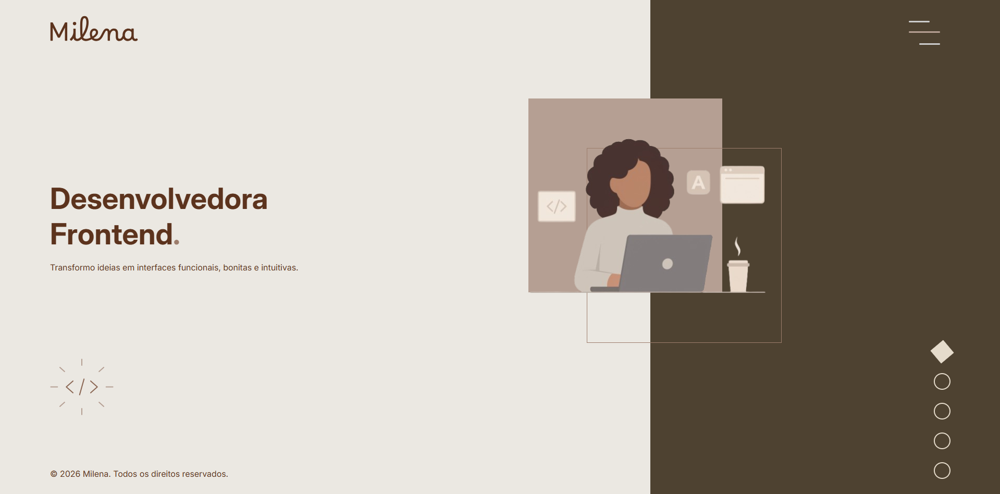
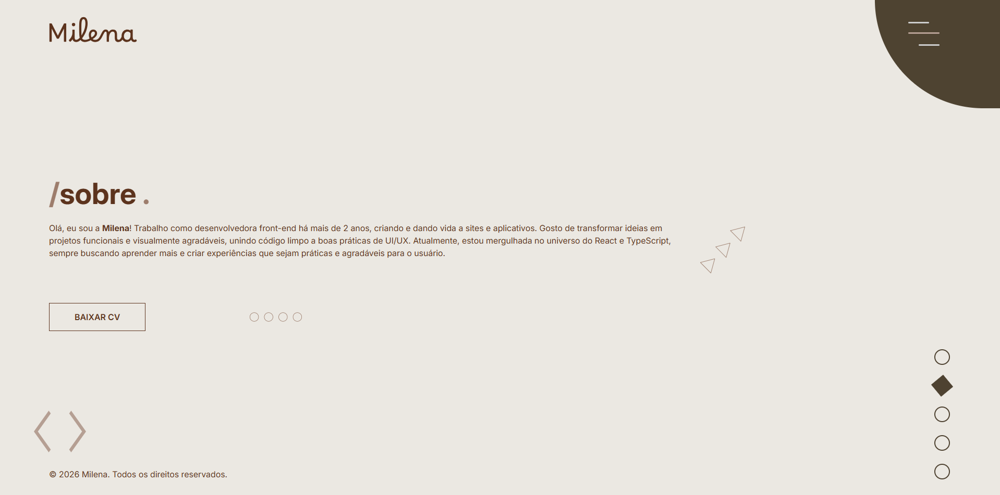
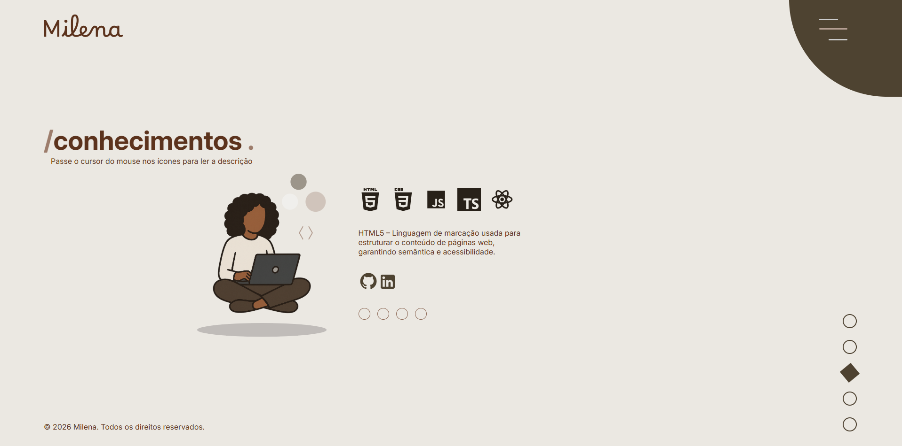
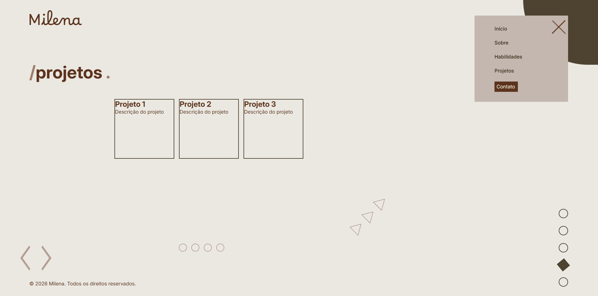
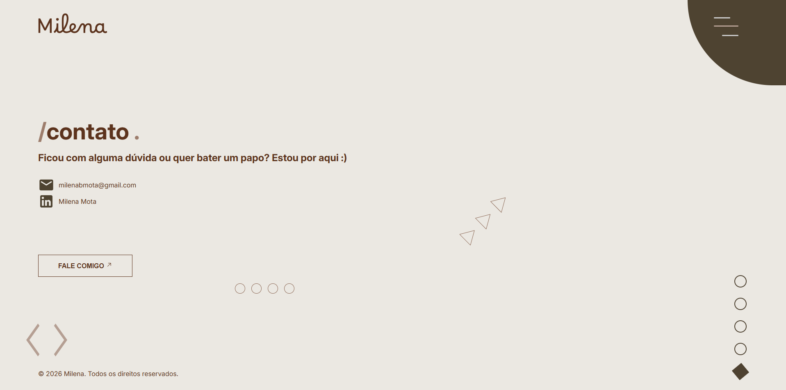
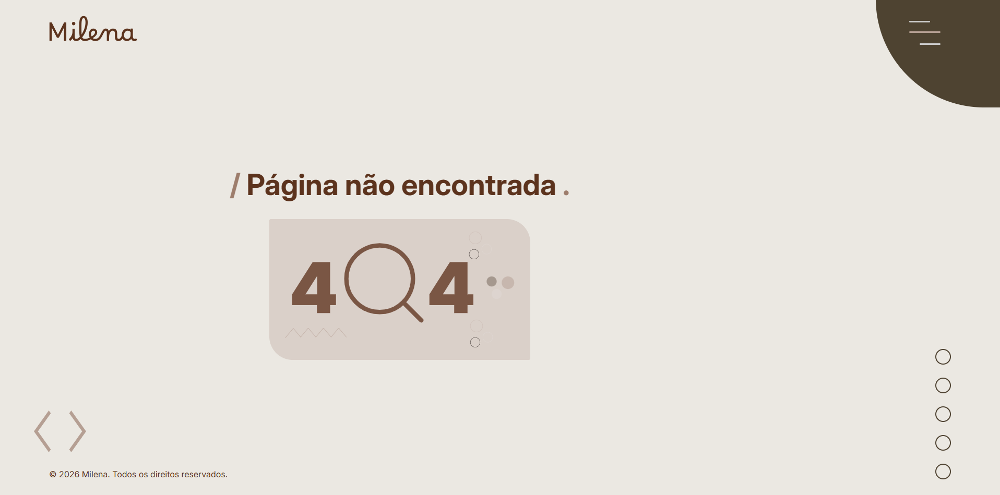

# Portifólio de Milena

Bem-vindo ao meu portfólio!

Aqui compartilho alguns projetos que desenvolvi no Front-end, unindo prática e aprendizado.

## Sobre mim

Sou desenvolvedora Front-end com mais de 2 anos de experiência na manutenção e desenvolvimento de sites e aplicações web.  
Gosto de transformar ideias em projetos funcionais e visualmente agradáveis, unindo código limpo a boas práticas de **UI/UX**.  
Atualmente, estou me aprofundando em **React** e **TypeScript**.  

## Habilidades

- **HTML5 & CSS3** → Criação de layouts responsivos e acessíveis.  
- **JavaScript (ES6+)** → Lógica, interatividade e boas práticas.  
- **React (em aprendizado)** → Desenvolvimento de interfaces dinâmicas.  
- **TypeScript (em aprendizado)** → Tipagem para mais segurança no código.  
- **Git & GitHub** → Versionamento e colaboração em equipe.  
- **UI/UX** → Foco em usabilidade e experiência do usuário. 

## Como rodar  
Clone este repositório e rode o projeto localmente:  

```bash
git clone https://github.com/seu-usuario/seu-repositorio.git
cd seu-repositorio
npm install
npm run dev
```

---

## 📷 Imagens do projeto

Abaixo há prévias das telas do projeto (imagens em `docs/images`). Clique nas imagens para abrir em tamanho real.

<div style="display:flex; flex-wrap:wrap; gap:12px; align-items:flex-start; justify-content:center;">
 <a href="./docs/images/Home.png" style="flex:1 1 160px; max-width:220px;">
    
  </a>
  <a href="./docs/images/About.png" style="flex:1 1 160px; max-width:220px;">
    
  </a>
    <a href="./docs/images/Skill.png" style="flex:1 1 160px; max-width:220px;">
    
  </a>
    <a href="./docs/images/Project.png" style="flex:1 1 160px; max-width:220px;">
    
  </a>
  <a href="./docs/images/Contact.png" style="flex:1 1 160px; max-width:220px;">
    
  </a>
  <a href="./docs/images/Error.png" style="flex:1 1 160px; max-width:220px;">
    
  </a>
</div>

---

## Contato
- ✉️ Email: milenabmota@gmail.com